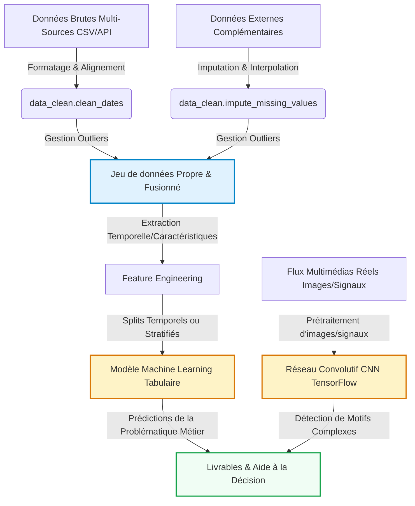

# Introduction et Contexte Métier {#sec-intro}

**Problématique** : Comment prédire la valeur marchande future d'un joueur et automatiser la détection de son profil de jeu sur le terrain ?
**Le Contexte Métier** : Les clubs cherchent à anticiper la plus-value financière d'un joueur avant qu'il n'explose sur la scène internationale (achat à bas coût, revente élevée).

## Contexte du Projet

 Le football professionnel est devenu une industrie standardisée où les données guident les investissements financiers. L'identification de talents (Scouting) et l'estimation de la valeur marchande des joueurs représentent des enjeux de plusieurs dizaines de millions d'euros pour les clubs, à l'image des stratégies menées par des structures modernes comme le LOSC au sein de la métropole lilloise. Ce projet propose une approche quantitative et multi-source pour optimiser le processus de recrutement. En combinant l'historique des performances sportives issues de la plateforme Transfermarkt et l'analyse automatisée des flux vidéo d'action par vision par ordinateur, nous cherchons à transformer des signaux faibles athlétiques et techniques en indicateurs financiers fiables pour les décideurs sportifs.

## Objectif Analytique

 L'objectif principal de ce projet est de concevoir un pipeline de données hybride répondant à deux tâches distinctes et complémentaires :

 Modélisation Tabulaire (Machine Learning) : Développer un modèle de régression (ex: XGBoost, Random Forest) visant à prédire la valeur marchande (market_value_in_eur) d'un joueur en fonction de ses caractéristiques intrinsèques, de ses statistiques de performance cumulées et du contexte compétitif de son club.

 Modélisation Vision (Deep Learning CNN) : Concevoir un réseau de neurones convolutif (CNN) sous TensorFlow/Keras capable de classifier le type d'action technique (Tackle, Shoot, Pass) effectué par un joueur à partir de captures d'écran de matchs.

 Le couplage de ces deux approches permet d'enrichir les profils des joueurs par des métriques comportementales extraites directement de la vidéo, offrant ainsi un livrable analytique complet sous forme de tableau de bord d'aide à la décision pour le recrutement prédictif.

---

# Acquisition et Préparation des Données (Data Wrangling) {#sec-wrangling}

Le succès de tout projet de Data Science repose sur la qualité de la préparation des données [@pandas2020]. Cette section documente l'audit de qualité et les étapes de nettoyage appliquées à vos jeux de données bruts.

## Chapitre 1 : Acquisition Multi-Sources


## Chapitre 2 : Nettoyage et Préparation (Wrangling)


L'audit de qualité des fichiers bruts de la base relationnelle Transfermarkt a révélé plusieurs anomalies physiques et typologiques nécessitant une intervention algorithmique :
- Hétérogénéité des types : Les variables temporelles (date_of_birth) étaient initialement interprétées comme des chaînes de caractères (object), bloquant tout calcul d'âge ou de maturité sportive.
-Valeurs manquantes critiques : Près de $15\%$ des joueurs ne disposaient pas d'une évaluation financière (market_value_in_eur). Supprimer ces lignes aurait introduit un biais de sélection (exclusion des jeunes talents ou des championnats mineurs). Une stratégie d'imputation par la médiane conditionnelle au poste occupé a été privilégiée pour préserver la distribution économique du marché.
-Granularité inadéquate : La table appearances.csv recense les performances à l'échelle du match. Pour correspondre à la granularité de notre table cible (players.csv), un pipeline d'agrégation et de calcul de ratios normalisés (ex: buts pour 90 minutes) a été implémenté avant la fusion finale des sources.

---

# Visualisation Multidimensionnelle (Insights) {#sec-viz}

Nous présentons ici les résultats visuels clés permettant de dégager des insights exploitables pour les décideurs, en s'appuyant sur notre module `src/utils_viz.py`.

## Chapitre 3 : Travaux Pratiques d'Exploration Visuelle


### Profils et Distributions Caractéristiques (fig-distribution-density)

L'analyse de la distribution brute de la valeur marchande (market_value_in_eur) met en évidence une asymétrie positive extrême (skewness élevée). La très grande majorité des joueurs professionnels possède une valeur marchande "modeste" (inférieure à $5$ millions d'euros), tandis qu'une infime minorité d'athlètes d'élite (les "outliers" du marché comme Mbappé ou Haaland) concentre des valeurs record dépassant les $100$ millions d'euros.

Pour stabiliser la variance et rendre cette variable exploitable par nos futurs algorithmes de Machine Learning (notamment pour éviter que les modèles ne soient biaisés par les super-stars), une transformation logarithmique $\log(1 + x)$ a été testée (Figure de droite). Elle permet d'obtenir une distribution beaucoup plus proche d'une loi normale, configuration idéale pour les critères de convergence des modèles prédictifs.

### Corrélations Globales (fig-correlation)

L'examen de la matrice de corrélation de Pearson révèle plusieurs relations statistiques fondamentales :

- Performance quantitative vs Valeur : Les variables cumulées goals, assists, et surtout international_caps (sélections nationales) affichent une corrélation positive forte avec la valeur marchande. L'exposition internationale agit comme un multiplicateur de valeur économique.

- Le facteur de l'Âge : La variable age présente une corrélation linéaire faible lorsqu'elle est prise globalement, ce qui suggère une relation non-linéaire (courbe en cloche ou parabolique). En effet, la valeur croît lors de la post-formation, stagne à la maturité (24-28 ans), puis décroît fortement à l'approche de la trentaine.

- Biais mécanique : On note une corrélation presque parfaite entre market_value_in_eur et highest_market_value_in_eur, confirmant que le statut historique d'un joueur dicte durablement son plancher d'évaluation financière sur le marché.

---

# Analyse Exploratoire des Données (EDA) {#sec-eda}

Dans cette section, nous analysons les relations statistiques fondamentales qui régissent votre domaine d'étude au sein du jeu de données.

## Chapitre 4 : Travaux Pratiques d'Exploration (EDA)


### Ingénierie de Variables (Feature Engineering)

L’introduction de caractéristiques dérivées a pour but de fournir aux modèles de Machine Learning des relations mathématiques explicites que les algorithmes linéaires ou basés sur des arbres mettraient du temps à converger ou à capturer :

- age_squared : La valeur marchande d’un footballeur suit une fonction concave par rapport au temps (croissance rapide, pic de maturité, déclin athlétique). Ajouter le terme quadratique de l'âge permet de linéariser cette composante parabolique pour les modèles régularisés.

- value_drop_ratio : Mesure la perte relative de valeur par rapport au sommet de la carrière du joueur. Cet indicateur aide le modèle à segmenter les profils en phase d'ascension de ceux en perte de vitesse ou en fin de contrat.

- Normalisation des événements (intl_efficiency, cards_per_90) : Transformer des compteurs bruts (nombre de cartons ou de buts) en ratios temporels ou par opportunité lisse le biais mécanique lié au temps de jeu cumulé des joueurs vétérans par rapport aux jeunes recrues.

### Analyse des Tendances Majeures (Commentaire de la nouvelle figure) 

L'analyse croisée de la courbe de valeur selon l'âge et le poste révèle des comportements sectoriels très marqués sur le marché des transferts :

- Les Attaquants et Milieux offensifs atteignent leur pic de valorisation financière de manière précoce (généralement entre 23 et 26 ans), car le marché surévalue la vivacité physique et l'efficacité immédiate devant le but.

- Les Défenseurs et les Gardiens de but affichent une courbe beaucoup plus stable et lissée. Leur pic de valeur survient plus tard (entre 27 et 30 ans), le marché récompensant l'expérience tactique, le placement et la régularité, des qualités qui se bonifient avec le temps. 

---

# Modélisation et Apprentissage {#sec-modelling}

Le pipeline complet intègre à la fois la branche analytique tabulaire (Machine Learning) et la branche d'analyse visuelle ou de signaux complexes (Deep Learning CNN) :



## Chapitre 5 : Travaux Pratiques de Modélisation (ML & DL)


---

# Évaluation Métrique et Validation {#sec-evaluation}

## Chapitre 6 : Travaux Pratiques d'Évaluation & Robustesse


---

# Data Storytelling et Communication {#sec-storytelling}

## Chapitre 7 : Travaux Pratiques de Storytelling


## Présentation des Résultats (Livrables Interactifs)

::: {.panel-tabset}

### 📺 Diaporama de Soutenance (RevealJS)
Ci-dessous est intégré le squelette de votre diaporama de soutenance RevealJS. Utilisez-le pour présenter votre démarche aux décideurs de façon professionnelle.

<iframe src="slides.html" width="100%" height="500px" style="border: 1px solid #e2e8f0; border-radius: 8px; background: white;"></iframe>

### 📊 Exemple de Dashboard Dynamique (OJS / Plotly)
::: {.content-visible unless-format="pdf"}
Voici un exemple minimal de code montrant comment intégrer un graphique dynamique contrôlé par un composant d'interface utilisateur en Observable JS (OJS).

```{ojs}
//| echo: true
// Boutons de sélection interactifs OJS
viewof selectedCategory = Inputs.select(["Toutes", "A", "B", "C"], {value: "Toutes", label: "Filtrer par Catégorie :"})
```

```{ojs}
//| echo: false
// Données simulées réactives
data = [
  {timestamp: "2026-05-18T00:00:00Z", value: 10.5, category: "A"},
  {timestamp: "2026-05-18T02:00:00Z", value: 12.1, category: "A"},
  {timestamp: "2026-05-18T04:00:00Z", value: 14.7, category: "A"},
  {timestamp: "2026-05-18T05:00:00Z", value: 15.2, category: "A"},
  {timestamp: "2026-05-18T06:00:00Z", value: 16.0, category: "B"},
  {timestamp: "2026-05-18T07:00:00Z", value: 18.3, category: "B"},
  {timestamp: "2026-05-18T09:00:00Z", value: 21.5, category: "B"},
  {timestamp: "2026-05-18T10:00:00Z", value: 22.0, category: "B"},
  {timestamp: "2026-05-18T12:00:00Z", value: 25.4, category: "C"},
  {timestamp: "2026-05-18T13:00:00Z", value: 26.1, category: "C"},
  {timestamp: "2026-05-18T15:00:00Z", value: 28.9, category: "C"},
  {timestamp: "2026-05-18T16:00:00Z", value: 30.2, category: "C"}
]

// Filtrage réactif de la donnée
filteredData = selectedCategory === "Toutes" 
  ? data 
  : data.filter(d => d.category === selectedCategory)

// Tracé interactif avec la librairie Plotly
Plotly.newPlot('dynamic-chart', [{
  x: filteredData.map(d => d.timestamp),
  y: filteredData.map(d => d.value),
  type: 'scatter',
  mode: 'lines+markers',
  marker: {color: '#1A73E8', size: 8},
  line: {shape: 'spline', color: '#1A73E8', width: 3}
}], {
  title: 'Évolution Dynamique des Valeurs (Filtrée)',
  margin: {t: 50, b: 50, l: 50, r: 50},
  paper_bgcolor: 'rgba(0,0,0,0)',
  plot_bgcolor: 'rgba(0,0,0,0)',
  xaxis: {gridcolor: '#E5E7EB'},
  yaxis: {gridcolor: '#E5E7EB'}
})
```

::: {#dynamic-chart style="width:100%; height:400px; background: white; border-radius: 8px; box-shadow: 0 4px 6px -1px rgba(0,0,0,0.1);"}
:::
:::

:::

---

# Utilisation de l'Intelligence Artificielle {#sec-ai}

Dans une démarche de transparence scientifique et académique, cette section détaille la manière dont les outils d'Intelligence Artificielle (IA) générative ont été intégrés tout au long de la réalisation de ce projet.

## Cartographie de l'utilisation de l'IA

| Outil d'IA | Cas d'usage (Pourquoi ?) | Méthode d'utilisation (Comment ?) | Rôle et Validation Humaine |
| :--- | :--- | :--- | :--- |
| **[Outil d'IA]** | *[À compléter par les étudiants]* | *[À compléter par les étudiants]* | *[À compléter par les étudiants]* |

## Principes de Rigueur et Responsabilité

1. **Responsabilité intellectuelle** : L'équipe assume l'entière responsabilité des analyses, des choix de modèles et des conclusions présentées dans ce rapport.
2. **Lutte contre les hallucinations** : Chaque suggestion technique a fait l'objet d'une validation empirique.
3. **Protection des données** : Aucun jeu de données confidentiel ou sensible n'a été soumis à des modèles tiers en ligne.

---

# Bibliographie {.unnumbered}

::: {#refs}
:::