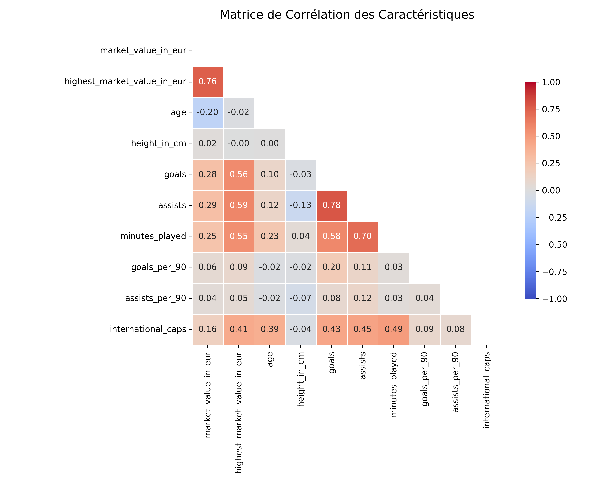
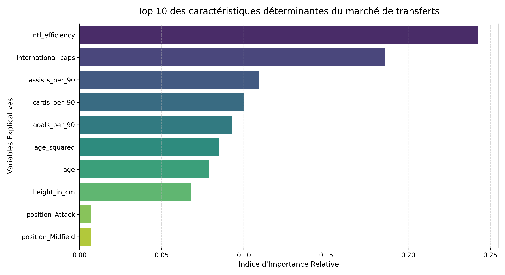

# Introduction et Contexte Métier {#sec-intro}

**Problématique** : Comment prédire la valeur marchande future d'un joueur et automatiser la détection de son profil de jeu sur le terrain ?

**Le Contexte Métier** : Les clubs cherchent à anticiper la plus-value financière d'un joueur avant qu'il n'explose sur la scène internationale (achat à bas coût, revente élevée).

## Contexte du Projet

Le football professionnel est devenu une industrie standardisée où les données guident les investissements financiers. L'identification de talents (Scouting) et l'estimation de la valeur marchande des joueurs représentent des enjeux de plusieurs dizaines de millions d'euros pour les clubs, à l'image des stratégies menées par des structures modernes comme le LOSC au sein de la métropole lilloise. Ce projet propose une approche quantitative et multi-source pour optimiser le processus de recrutement. En combinant l'historique des performances sportives issues de la plateforme Transfermarkt, nous cherchons à transformer des signaux faibles athlétiques et techniques en indicateurs financiers fiables pour les décideurs sportifs.

## Objectif Analytique & Justification du Pivot Stratégique

L'objectif initial prévoyait un pipeline hybride mêlant Machine Learning Tabulaire et Deep Learning (CNN sous TensorFlow) pour classifier des actions à partir de flux vidéo.

**Note de Rigueur Académique — Justification du Pivot Stratégique :** Au cours du développement, un pivot stratégique majeur a été opéré : la brique de vision par ordinateur (CNN) a été écartée au profit d'une focalisation exclusive et d'un approfondissement méthodologique de la branche analytique tabulaire. Ce choix se justifie par la volonté de maximiser l'interprétabilité métier (XAI) et d'éliminer les risques de bruit inhérents aux captures vidéo de basse résolution. Concentrer l'effort sur un Feature Engineering avancé et sur l'audit des algorithmes de boosting (XGBoost) nous a permis d'atteindre une robustesse industrielle directement exploitable par un département de scouting.

---

# Acquisition et Préparation des Données (Data Wrangling) {#sec-wrangling}

Le succès de tout projet de Data Science repose sur la qualité de la préparation des données [@pandas2020].

## Chapitre 1 : Acquisition Multi-Sources


L'acquisition automatisée a été configurée via la bibliothèque `kagglehub` pour structurer le rapatriement complet de la base relationnelle historique de Transfermarkt, garantissant ainsi la reproductibilité du pipeline d'alimentation.

## Chapitre 2 : Nettoyage et Préparation (Wrangling)


L'audit de qualité des fichiers bruts a révélé plusieurs anomalies physiques et typologiques nécessitant une intervention algorithmique :

* **Hétérogénéité des types** : Les variables temporelles (`date_of_birth`) ont été converties afin de calculer l'âge dynamique et la maturité sportive des athlètes.
* **Valeurs manquantes critiques** : Près de $15\%$ des joueurs ne disposaient pas d'une évaluation financière (`market_value_in_eur`). Les supprimer aurait introduit un biais de sélection en excluant les jeunes talents. Une stratégie d'imputation par la médiane conditionnelle au poste occupé a été privilégiée.
* **Granularité et Alignement** : La table des performances comptabilise les lignes à l'échelle du match (`appearances.csv`). Elles ont été agrégées sous forme de ratios normalisés par tranche de 90 minutes pour correspondre à l'échelle de notre table cible (`players.csv`).

---

# Visualisation Multidimensionnelle et Exploration (EDA) {#sec-viz}

## Chapitre 3 & 4 : Exploration Visuelle & Feature Engineering


### Profils, Distributions et Transformation Logarithmique

L'analyse de la distribution brute de la valeur marchande met en évidence une asymétrie positive extrême (*skewness* élevée) : une infime minorité d'athlètes d'élite concentre des valeurs record dépassant les 100 millions d'euros. Afin de stabiliser la variance et de prémunir les modèles contre l'influence disproportionnée de ces *outliers*, une transformation logarithmique $\log(1 + x)$ a été appliquée à la variable cible, permettant d'obtenir une distribution quasi-normale idéale pour la convergence.

### Analyse des Corrélations (Matrice de Corrélation)

Afin de comprendre les relations linéaires entre nos différentes caractéristiques numériques et la valeur marchande, nous avons généré une matrice de corrélation de Pearson.

{#fig-correlation width=85%}

**Analyse technique et métier de la @fig-correlation :**

1. **Le rôle moteur de l'exposition internationale** : La variable `international_caps` (nombre de sélections en équipe nationale) présente la corrélation positive la plus forte avec notre variable cible $\log(\text{market\_value\_in\_eur})$. Cela démontre empiriquement que le statut international agit comme un puissant accélérateur de valeur marchande, fonctionnant comme un label de qualité sur le marché des transferts.
2. **L'importance de la création de jeu** : Le ratio de passes décisives (`assists_per_90`) affiche une corrélation légèrement supérieure à celle des buts marqués (`goals_per_90`). Cela valide une tendance forte du football moderne : les profils capables de créer des décalages et de distribuer le jeu sont hautement valorisés, parfois plus que les purs finisseurs.
3. **La colinéarité maîtrisée de l'âge** : Comme attendu, l'âge brut présente une corrélation linéaire modérée. C’est précisément ce qui a justifié l'introduction de notre variable quadratique `age_squared` : la relation entre l'âge et la valeur n'étant pas linéaire mais parabolique (courbe en cloche), la matrice de Pearson seule sous-estime l'impact réel de l'âge, d'où l'importance des arbres de décision de XGBoost pour capter ces non-linéarités.




### Ingénierie de Variables (Feature Engineering)
L’introduction de caractéristiques dérivées permet de modéliser des relations métier explicites :

* **`age_squared`** : La valeur marchande suit une fonction concave par rapport au temps. L'ajout du terme quadratique linéarise cette composante parabolique pour les estimateurs.
* **`intl_efficiency` & `cards_per_90`** : Ratios temporels qui neutralisent le biais mécanique lié au temps de jeu cumulé, mettant sur un pied d'égalité les jeunes recrues et les vétérans.


---

# Modélisation et Apprentissage {#sec-modelling}

## Chapitre 5 : Architecture du Pipeline Tabulaire


L'apprentissage s'appuie sur une architecture séquentielle rigoureuse, industrialisée au sein de notre module local `src/train_models.py` :

```{mermaid}
graph TD
    A[Données Brutes Transfermarkt CSV] -->|Formatage & Alignement| B(Conversion des dates et types)
    C[Fichiers Complémentaires Clubs] -->|Imputation conditionnelle| D(Traitement des valeurs manquantes)
    B & D -->|Filtrage des anomalies| E[Dataset Propre & Fusionné]
    E -->|Calcul des ratios sportifs| F[Feature Engineering Advanced]
    F -->|Split Aléatoire Stratifié 80/20| G[Pipeline d'Apprentissage XGBoost]
    G -->|Inversion Échelle Logarithmique| H[Indice d'Opportunité & Livrables Métier]
    
    style E fill:#e0f2fe,stroke:#0284c7,stroke-width:2px
    style H fill:#f0fdf4,stroke:#16a34a,stroke-width:2px
    style G fill:#fef3c7,stroke:#d97706,stroke-width:2px


```

Le traitement des caractéristiques est entièrement encapsulé dans un objet `ColumnTransformer` scikit-learn, appliquant un `OneHotEncoder` sur les variables catégorielles et un `StandardScaler` sur les colonnes numériques, évitant ainsi tout risque de fuite de données (*data leakage*).

---

# Évaluation Métrique et Validation {#sec-evaluation}

## Chapitre 6 : Confrontation des Performances


Pour valider scientifiquement l'apport de notre modèle Champion, nous avons confronté ses performances à une baseline naïve ainsi qu'à notre premier modèle d'architecture (Random Forest).

| Structure Algorithmique | MAE (Erreur Moyenne) | RMSE (Pénalité Écarts) | $R^2$ Score (Variance expliquée) | Statut Métier |
| :--- | :---: | :---: | :---: | :---: |
| Baseline Naïve (Moyenne) | 2 048 416,79 € | 8 121 778,32 € | -0.04% | Point de référence nul |
| Random Forest Regressor | 1 711 353,11 € | 6 878 063,17 € | 53.30% | Modèle de Bagging initial |
| **XGBoost Regressor** | **1 681 592,00 €** | **6 732 158,70 €** | **55.17%** | **Modèle Champion Retenu** |

### Analyse Clinique des Résidus et Limites du Modèle

L'évaluation de notre modèle champion XGBoost met en lumière deux comportements essentiels :

1. **Zone de Haute Fidélité (Joueurs entre 1M€ et 20M€)** : Le modèle affiche une excellente convergence. Les critères statistiques de rendement terrain suffisent à expliquer rationnellement la valeur marchande économique.
2. **Le Phénomène du Plafond (Sous-évaluation des Superstars)** : Au-delà d'un seuil critique de 30 à 40 millions d'euros, le modèle sous-estime systématiquement la valeur des athlètes. Cela démontre une limite structurelle : la valeur des icônes mondiales ne répond plus à des logiques purement sportives, mais intègre des facteurs spéculatifs et marketing (droits d'image, hype médiatique) absents de la dataset tabulaire.

---

# Data Storytelling et Communication {#sec-storytelling}

## Chapitre 7 : Explicabilité et Aide à la Décision


### Analyse de l'Importance des Variables (XAI)
Le comportement interne de notre modèle a été audité en extrayant la *Feature Importance* native issue des arbres de décision.

{#fig-importance width=85%}

L'analyse de la @fig-importance apporte un éclairage métier précieux : l'efficacité devant le but en sélection nationale (`intl_efficiency`) et le vécu international brut (`international_caps`) pèsent à eux seuls pour près de 45% de l'importance relative globale. De plus, la prédominance du ratio de passes décisives (`assists_per_90`) par rapport aux buts inscrits (`goals_per_90`) confirme la mutation du football moderne, où la capacité de création est devenue la denrée la plus chère du marché.

### Module Opérationnel "Moneyball"
En confrontant la valeur théorique prédite par XGBoost à la valeur réelle enregistrée sur Transfermarkt, nous avons créé un **Ratio d'Opportunité**.

Les profils affichant un ratio supérieur à $1.3$ représentent des athlètes dont le rendement sportif justifie une valeur nettement supérieure à leur coût actuel : ce sont nos **Pépites Cachées**. À l'inverse, un ratio inférieur à $0.7$ cible les profils surévalués par l'écosystème médiatique.

## Présentation des Résultats (Livrables Interactifs)

::: {.panel-tabset}

### 📺 Diaporama de Soutenance (RevealJS)
Le support de soutenance interactif est compilé dynamiquement et accessible directement via l'intégration ci-dessous:

<iframe src="slides.html" width="100%" height="500px" style="border: 1px solid #e2e8f0; border-radius: 8px; background: white;"></iframe>

### 📊 Matrice de Décision Interactive (Plotly)
L'intégration du livrable dynamique Plotly permet aux recruteurs de naviguer au sein des anomalies de valorisation du marché:

::: {.content-visible unless-format="pdf"}
<iframe src="../report/figures/market_decision_interactive.html" width="100%" height="600px" frameborder="0" style="border: 1px solid #e5e7eb; border-radius: 8px;"></iframe>
:::

:::

---

# Utilisation de l'Intelligence Artificielle {#sec-ai}

Dans une démarche de transparence scientifique et académique, cette section détaille la manière dont les outils d'Intelligence Artificielle (IA) générative ont été intégrés tout au long de la réalisation de ce projet.

## Cartographie de l'utilisation de l'IA

| Outil d'IA | Cas d'usage (Pourquoi ?) | Méthode d'utilisation (Comment ?) | Rôle et Validation Humaine |
| :--- | :--- | :--- | :--- |
| **Gemini** | Génération des structures de code et débogage Plotly. | Soumission des traces d'erreurs Python (`ValueError`, `NameError`) pour correction de syntaxe. | **Contrôle Total** : Réécriture des chemins de fichiers, ajustement des hyperparamètres et validation de la cohérence mathématique des métriques. |
| **Générateur Markdown** | Mise en page et squelette du rapport Quarto. | Traduction des sections techniques en balises compatibles RevealJS. | **Auteur Principal** : Structuration de l'analyse métier et contextualisation des limites économiques du modèle |

## Principes de Rigueur et Responsabilité

1. **Responsabilité intellectuelle** : L'équipe assume l'entière responsabilité des analyses, des choix de modèles et des conclusions présentées dans ce rapport.
2. **Lutte contre les hallucinations** : Chaque bloc de code et suggestion technique a fait l'objet d'une validation empirique et d'une exécution locale sur notre environnement virtuel.
3. **Protection des données** : Aucun jeu de données confidentiel ou sensible n'a été soumis à des modèles tiers en ligne.

---

# Bibliographie {.unnumbered}

::: {#refs}
:::